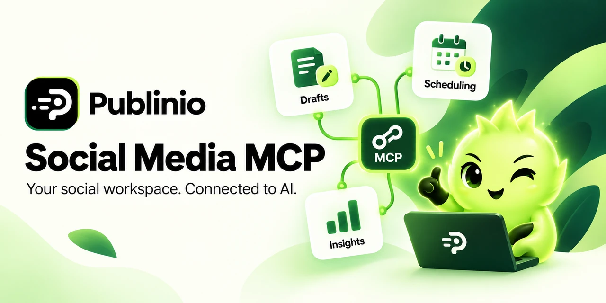

# Publinio Social Media MCP

Connect your AI assistant to your Publinio social workspace: brand context, reviewable drafts, future scheduling, saved analytics, and permissioned research.

[](https://github.com/Kingjam99/social-media-mcp/actions/workflows/check.yml)
[](LICENSE)

[Connect your assistant](docs/connect.md) · [Tool reference](docs/tools.md) · [Examples](examples/README.md) · [Publinio](https://www.publinio.com) · [Developer docs](https://www.publinio.com/developers/mcp/)

## Connect

**Hosted MCP endpoint**

```text
https://api.publinio.com/mcp
```

Choose **Streamable HTTP** and **OAuth** in your MCP client. Sign in to Publinio, select the intended brands, and authorize the permissions you need. A Publinio account is required; client/workspace access, plan allowances, and workspace credits apply.

Start with a read-only prompt:

> Use Publinio to list the brands I can access, then show the context for the brand I choose. Do not change anything.

[Step-by-step setup for ChatGPT, Claude and Claude Code →](docs/connect.md)

## What you can do

| Workflow | What Publinio provides |
| --- | --- |
| Brand context | Approved facts, voice and saved brand information |
| Content | Reviewable drafts using supplied text and existing media |
| Campaigns and scheduling | Reviewed campaigns and posts at explicit future times |
| Analytics | Saved reports with capture timestamps and honest coverage |
| Research | Saved evidence and quoted, permissioned Market Intelligence |
| Automations | Review-first recipes, sample approval and capped activation |
| Advertising | Supported connected-account reports and public ad research |

Draft creation saves a draft. Scheduling is a separate action with revision, approval, destination and credit checks. X scheduling reserves the required workspace credits. Saved analytics do not silently trigger paid refreshes. [Permissions and costs →](docs/permissions.md)

## Run the examples

Node.js **22 or newer**:

```sh
git clone https://github.com/Kingjam99/social-media-mcp.git
cd social-media-mcp
npm ci
npm run example -- discover
```

The example prints a Publinio sign-in URL. Open it in your browser and authorize the requested brand access. Tokens stay in memory and expire with the process.

[Create a draft, schedule a reviewed post, or read saved analytics →](examples/README.md)

## What's in this repository

- Current client setup and practical prompt workflows.
- A versioned public catalogue: **80 tool descriptors**, including **76 model-callable tools** and **4 app-only controls**. Each includes input/output schemas and required scope.
- Runnable JavaScript examples built on the official MCP SDK.
- Original Publinio cover artwork and a 1280 × 640 social-preview image.
- Contribution, security and MIT license guidance.

This repository is the public integration kit for Publinio's hosted service. Running the examples connects to Publinio; it does not start a local Publinio server. The hosted application, infrastructure and provider credentials are managed separately.

## Compatibility and verification

The server uses Streamable HTTP, OAuth, and optional MCP Apps UI. Clients that support the transport and authorization can use permitted model-callable tools; embedded cards depend on the client's MCP Apps support.

Local protocol integration tests cover discovery, draft/scheduling behavior and saved metrics. OAuth callback and permission guards are tested. These checks do not certify every assistant's current UI or a real-account publishing journey. The catalogue is a **2026-10-07** snapshot; live tool discovery and `get_workspace_capabilities` determine current access.

[Hosting and catalogue versions](docs/compatibility.md) · [Troubleshooting](docs/troubleshooting.md) · [Contributing](CONTRIBUTING.md) · [Security](SECURITY.md)

## License

Code and documentation are MIT licensed. Publinio's name and brand marks remain subject to their owners' trademark rights. The hosted service uses its own [terms](https://www.publinio.com/terms/) and [privacy policy](https://www.publinio.com/privacy/).
